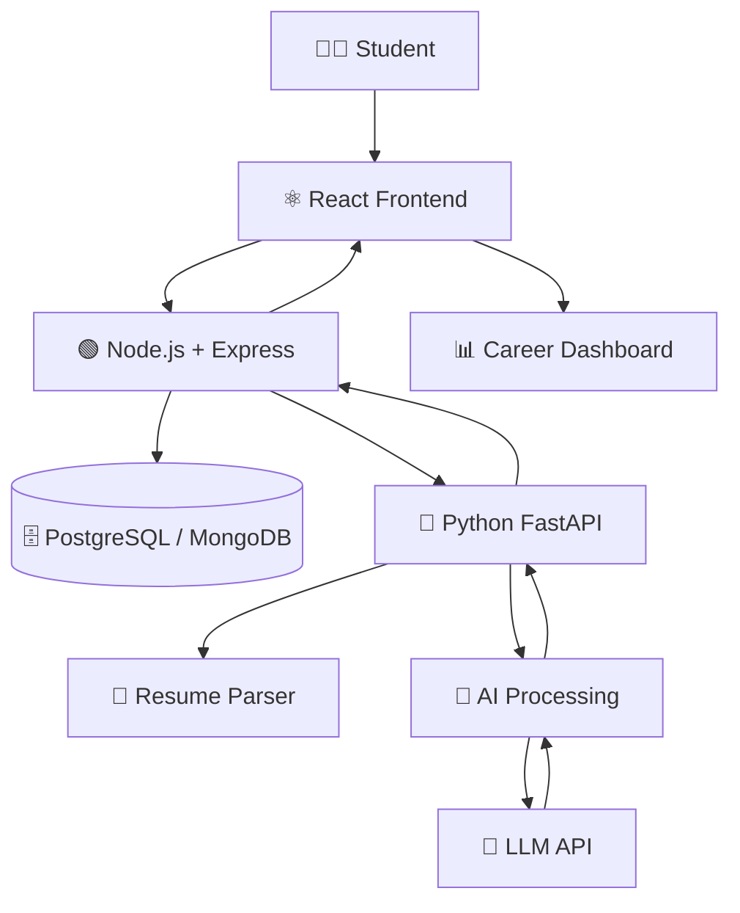

<div align="center">


<br/>


<br/><br/>


<br/><br/>

### 🧠 *Your Resume Tells Your Story. CareerPath AI Helps Build Your Future.*

</div>

---

# 🌟 What is CareerPath AI?

**CareerPath AI** is an AI-powered career guidance platform designed to help students understand:

> **Where am I now? → What am I missing? → What should I do next?**

Students upload their resume and receive an intelligent analysis covering:

* 📊 Resume Score
* 🧾 ATS Analysis
* 💪 Strengths
* ⚠️ Weaknesses
* 🛠️ Skill Gaps
* ✍️ Resume Corrections
* 🎯 Career Recommendations
* 🗺️ Personalized Career Roadmap

Instead of simply saying:

> ❌ *"Your resume score is 78/100."*

CareerPath AI aims to say:

> ✅ *"Your resume score is 78/100. Here are your weaknesses, these are the skills you're missing, and here's the roadmap you should follow to become career-ready."*

---

# ⚡ The Vision

<div align="center">

### Traditional Resume Tool

```text
Resume
  ↓
Score
  ↓
Done ❌
```

### 🚀 CareerPath AI

```text
                    📄 Resume
                       │
                       ▼
                🔍 AI Analysis
                       │
          ┌────────────┼────────────┐
          ▼            ▼            ▼
      📊 Score     🛠️ Skill Gap   ✍️ Corrections
          │            │            │
          └────────────┼────────────┘
                       ▼
                🧠 AI Insights
                       │
                       ▼
              🗺️ Career Roadmap
                       │
                       ▼
                 🎯 Career Ready
```

</div>

---

# 🎯 Problem We Are Solving

Students today have access to thousands of:

* YouTube tutorials
* Online courses
* Documentation
* Coding platforms
* Certifications
* Career resources

But the biggest problem is often:

> **"What should I learn next?"**

A student may know Python but not know whether to learn:

```text
Python
   ↓
NumPy?
   ↓
Pandas?
   ↓
Machine Learning?
   ↓
Deep Learning?
   ↓
Projects?
   ↓
Deployment?
```

CareerPath AI aims to convert this confusion into a **clear, personalized action plan**.

---

# 💡 Core Concept

<div align="center">

### Analyze → Understand → Improve → Build → Grow 🚀

</div>

```text
┌─────────────┐
│   RESUME    │
└──────┬──────┘
       ↓
┌─────────────┐
│   PARSING   │
└──────┬──────┘
       ↓
┌─────────────┐
│ AI ANALYSIS │
└──────┬──────┘
       ↓
┌──────────────────────────┐
│                          │
│  Resume Score            │
│  ATS Analysis            │
│  Skill Gap               │
│  Corrections             │
│  Recommendations         │
│                          │
└────────────┬─────────────┘
             ↓
┌──────────────────────────┐
│ PERSONALIZED ROADMAP     │
└────────────┬─────────────┘
             ↓
┌──────────────────────────┐
│ CAREER DASHBOARD         │
└──────────────────────────┘
```

---

# ✨ Features

## 📄 01 — Resume Upload

Upload your resume and let CareerPath AI analyze it.

**Supported formats:**

```text
📄 PDF
📄 DOCX
```

The uploaded document is processed and converted into usable text for analysis.

---

## 🤖 02 — AI Resume Analysis

The AI analyzes important resume information such as:

```text
┌────────────────────────┐
│ 👤 Personal Information│
│ 🎓 Education           │
│ 💻 Technical Skills    │
│ 🛠️ Projects            │
│ 💼 Experience          │
│ 🏆 Certifications      │
│ 🧠 Soft Skills         │
└────────────────────────┘
```

The system identifies both strengths and areas that require improvement.

---

## 📊 03 — Resume Score

CareerPath AI generates an overall resume score.

```text
              RESUME SCORE

              ┌─────────┐
              │   78    │
              │  / 100  │
              └─────────┘

       ███████████████░░░░░

       Keep improving 🚀
```

The score can consider factors such as:

* Resume quality
* Skills
* Projects
* Experience
* ATS compatibility
* Content quality

---

## 🧾 04 — ATS Analysis

Applicant Tracking Systems are commonly used to filter resumes.

CareerPath AI aims to identify problems such as:

```text
❌ Missing keywords
❌ Weak section structure
❌ Poor formatting
❌ Missing technical skills
❌ Weak project descriptions
❌ Unclear content
```

And provide actionable suggestions.

---

# 🛠️ 05 — Skill Gap Analysis

One of the core features.

CareerPath AI compares:

```text
YOUR CURRENT SKILLS
        +
TARGET CAREER
        ↓
SKILL GAP ANALYSIS
        ↓
WHAT YOU NEED TO LEARN
```

### Example

**Target Role:** AI Engineer

```text
Current Skills
────────────────────────
Python              ✅
SQL                 ✅
Git                 ✅
Machine Learning    ❌
Deep Learning       ❌
NLP                 ❌
```

### Identified Skill Gap

```text
🟥 Machine Learning
🟥 Deep Learning
🟥 Natural Language Processing
```

---

# ✍️ 06 — AI Resume Corrections

CareerPath AI doesn't just identify a weak section.

It suggests how to improve it.

### ❌ Before

```text
Made a student management project using Python.
```

### ✅ AI Recommendation

```text
Developed a Student Management System using Python
and SQLite with CRUD operations for efficient student
record management.
```

The goal is to create resume content that is:

```text
Clear
  +
Professional
  +
Specific
  +
Impactful
```

---

# 🗺️ 07 — Personalized Career Roadmap

This is where CareerPath AI goes beyond traditional resume analyzers.

The system can convert skill gaps into a learning roadmap.

### Example — AI Engineer Roadmap

```text
                 🎯 AI ENGINEER
                       │
                       ▼
              ┌─────────────────┐
              │ MONTH 1         │
              │ Python          │
              │ Git             │
              │ SQL             │
              └────────┬────────┘
                       ↓
              ┌─────────────────┐
              │ MONTH 2         │
              │ NumPy           │
              │ Pandas          │
              │ Machine Learning│
              └────────┬────────┘
                       ↓
              ┌─────────────────┐
              │ MONTH 3         │
              │ Scikit-learn    │
              │ ML Projects     │
              │ Deployment      │
              └────────┬────────┘
                       ↓
              ┌─────────────────┐
              │ MONTH 4         │
              │ Deep Learning   │
              │ NLP             │
              │ Portfolio       │
              └────────┬────────┘
                       ↓
                   🚀 READY
```

---

# 📈 08 — Career Dashboard

The dashboard brings everything together.

```text
╔══════════════════════════════════════╗
║          CAREER DASHBOARD            ║
╠══════════════════════════════════════╣
║                                      ║
║  Resume Score          78 / 100      ║
║  ATS Score             82 / 100      ║
║  Skills                12 / 20       ║
║  Projects               3            ║
║  Career Readiness      71%           ║
║                                      ║
║  ────────────────────────────────    ║
║                                      ║
║  🧠 Skills to Learn                  ║
║  • Machine Learning                  ║
║  • Deep Learning                     ║
║  • NLP                               ║
║                                      ║
║  🗺️ Current Roadmap                  ║
║  ███████████░░░░░░░                  ║
║                                      ║
╚══════════════════════════════════════╝
```

---

# 🔄 Complete Application Flow

<div align="center">

```text
👨‍🎓 STUDENT
      │
      ▼
🔐 LOGIN / REGISTER
      │
      ▼
📄 UPLOAD RESUME
      │
      ▼
📑 EXTRACT RESUME TEXT
      │
      ▼
🧠 AI PROCESSING
      │
      ├───────────────┐
      ▼               ▼
📊 RESUME SCORE    🧾 ATS SCORE
      │               │
      └───────┬───────┘
              ▼
        🛠️ SKILL GAP
              │
              ▼
       ✍️ CORRECTIONS
              │
              ▼
       🎯 RECOMMENDATIONS
              │
              ▼
        🗺️ ROADMAP
              │
              ▼
       📈 DASHBOARD
              │
              ▼
       🚀 CAREER READY
```

</div>

---

# 🏗️ System Architecture



---

# 🧠 AI Processing Pipeline

```text
                 📄 Resume
                    │
                    ▼
            ┌───────────────┐
            │ Text Extraction│
            └───────┬───────┘
                    ↓
            ┌───────────────┐
            │ Text Cleaning │
            └───────┬───────┘
                    ↓
            ┌───────────────┐
            │ Information   │
            │ Extraction    │
            └───────┬───────┘
                    ↓
            ┌───────────────┐
            │ AI Prompt     │
            │ Processing    │
            └───────┬───────┘
                    ↓
            ┌───────────────┐
            │    LLM API    │
            └───────┬───────┘
                    ↓
          ┌───────────────────┐
          │ Structured JSON   │
          │ AI Response       │
          └─────────┬─────────┘
                    ↓
              💾 Database
                    ↓
             📊 Dashboard
```

---

# 🧰 Technology Stack

<div align="center">

| Layer                      | Technology              |
| -------------------------- | ----------------------- |
| 🎨 Frontend                | HTML5, CSS3, JavaScript |
| ⚛️ UI Framework            | React.js                |
| 🟢 Main Backend            | Node.js + Express.js    |
| 🐍 AI Service              | Python + FastAPI        |
| 🗄️ Database               | PostgreSQL / MongoDB    |
| 🤖 Artificial Intelligence | LLM API                 |
| 🔐 Authentication          | JWT                     |
| 🌐 Version Control         | Git + GitHub            |

</div>

---

# 📂 Project Structure

```text
careerpath-ai/
│
├── 📁 frontend/
│   ├── 📁 public/
│   └── 📁 src/
│       ├── 📁 components/
│       ├── 📁 pages/
│       ├── 📁 layouts/
│       ├── 📁 services/
│       ├── 📁 hooks/
│       ├── 📁 context/
│       ├── 📁 utils/
│       ├── 📁 assets/
│       ├── 📄 App.jsx
│       └── 📄 main.jsx
│
├── 📁 backend/
│   └── 📁 node-server/
│       ├── 📁 src/
│       │   ├── 📁 controllers/
│       │   ├── 📁 routes/
│       │   ├── 📁 middleware/
│       │   ├── 📁 models/
│       │   ├── 📁 services/
│       │   ├── 📁 utils/
│       │   ├── 📁 config/
│       │   └── 📄 app.js
│       │
│       ├── 📄 package.json
│       └── 🔒 .env
│
├── 📁 ai-service/
│   ├── 📁 app/
│   │   ├── 📄 main.py
│   │   ├── 📁 routes/
│   │   ├── 📁 services/
│   │   ├── 📁 models/
│   │   ├── 📁 parsers/
│   │   ├── 📁 prompts/
│   │   └── 📁 utils/
│   │
│   ├── 📄 requirements.txt
│   └── 🔒 .env
│
├── 📁 docs/
│   ├── 📄 PRD.md
│   └── 📄 TRD.md
│
├── 📄 .gitignore
└── 📄 README.md
```

---

# 🔐 Security

CareerPath AI will implement security practices including:

```text
🔐 JWT Authentication
🔑 Password Hashing
🛡️ Input Validation
📄 File Type Validation
📦 File Size Restrictions
🚪 Protected API Routes
🔒 Environment Variables
🗄️ Secure Database Access
```

### ⚠️ Important

Never commit sensitive credentials such as:

```text
API Keys
Passwords
JWT Secrets
Database Credentials
```

to GitHub.

---

# 🗺️ Development Roadmap

## 🟢 Phase 1 — Foundation

```text
[x] Project Idea
[x] PRD
[x] TRD
[ ] Project Structure
[ ] React Setup
[ ] Node.js Setup
[ ] FastAPI Setup
```

---

## 🔵 Phase 2 — Authentication

```text
[ ] Register
[ ] Login
[ ] JWT Authentication
[ ] Protected Routes
[ ] User Profile
```

---

## 🟣 Phase 3 — Resume System

```text
[ ] Resume Upload
[ ] PDF Extraction
[ ] DOCX Extraction
[ ] Resume Text Processing
[ ] Resume Storage
```

---

## 🟠 Phase 4 — AI Analysis

```text
[ ] LLM API Integration
[ ] Resume Analysis
[ ] Resume Score
[ ] ATS Score
[ ] Strength Analysis
[ ] Weakness Analysis
[ ] Resume Corrections
```

---

## 🔴 Phase 5 — Career Intelligence

```text
[ ] Skill Gap Analysis
[ ] Career Recommendations
[ ] Personalized Roadmap
[ ] Project Recommendations
[ ] Learning Recommendations
```

---

## 🟡 Phase 6 — Dashboard

```text
[ ] Career Dashboard
[ ] Resume Score Visualization
[ ] Skill Progress
[ ] Roadmap Display
[ ] Career Readiness Score
```

---

## 🚀 Phase 7 — Advanced Features

```text
[ ] GitHub Profile Analysis
[ ] LinkedIn Profile Analysis
[ ] Job Description Matching
[ ] Job Recommendations
[ ] AI Interview Preparation
[ ] Mock Interview
[ ] Resume Builder
[ ] AI Career Assistant
```

---

# 🧪 Testing Strategy

### 🎨 Frontend

```text
✓ Component Testing
✓ Form Validation
✓ API Integration
✓ Responsive UI
```

### 🟢 Backend

```text
✓ Authentication
✓ API Endpoints
✓ File Upload
✓ Database Operations
✓ Error Handling
```

### 🧠 AI Service

```text
✓ Resume Extraction
✓ AI Response Validation
✓ Prompt Testing
✓ JSON Validation
✓ Skill-Gap Accuracy
```

---

# 📦 Installation

> 🚧 Installation instructions will be updated as development progresses.

### Clone the Repository

```bash
git clone <repository-url>
cd careerpath-ai
```

### Frontend

```bash
cd frontend
npm install
npm run dev
```

### Node.js Backend

```bash
cd backend/node-server
npm install
npm run dev
```

### AI Service

```bash
cd ai-service
pip install -r requirements.txt
uvicorn app.main:app --reload
```

---

# ⚙️ Environment Variables

### Node.js Backend

```env
PORT=5000
DATABASE_URL=your_database_url
JWT_SECRET=your_secret
AI_SERVICE_URL=http://localhost:8000
```

### AI Service

```env
PORT=8000
LLM_API_KEY=your_api_key
```

> 🔒 Never commit `.env` files to GitHub.

---

# 🧠 Example AI Response

CareerPath AI will preferably use structured JSON responses.

```json
{
  "resumeScore": 78,
  "atsScore": 82,
  "strengths": [
    "Good Python knowledge",
    "Relevant academic projects"
  ],
  "skillGaps": [
    "Machine Learning",
    "Deep Learning"
  ],
  "recommendations": [
    "Improve project descriptions",
    "Add measurable achievements"
  ]
}
```

This makes the AI output easier for the backend and frontend to process.

---

# 🌟 Why CareerPath AI?

| Traditional Resume Tool | 🚀 CareerPath AI                |
| ----------------------- | ------------------------------- |
| 📊 Resume Score         | 📊 Resume Score                 |
| 🧾 ATS Check            | 🧾 ATS Check                    |
| 💬 Basic Suggestions    | 🤖 AI Corrections               |
| ❌ No clear direction    | 🛠️ Skill Gap Analysis          |
| 📚 Generic Advice       | 🎯 Personalized Recommendations |
| 📄 Resume-focused       | 🚀 Career-focused               |
| ❌ Static Result         | 🗺️ Personalized Roadmap        |
| ❌ Limited Progress      | 📈 Career Readiness Tracking    |

---

# 🏆 The Core Differentiator

<div align="center">

```text
          TRADITIONAL TOOL

          "Your resume is 78/100."

                    ↓

                  DONE ❌
```

<br/>

```text
             🚀 CAREERPATH AI

       "Your resume is 78/100."

                    ↓

          🔍 Here's what's wrong.

                    ↓

          🛠️ Here's what you're missing.

                    ↓

          ✍️ Here's how to improve it.

                    ↓

          📚 Here's what you should learn.

                    ↓

          🗺️ Here's your roadmap.

                    ↓

          🎯 Here's how to become ready.
```

### **CareerPath AI doesn't just evaluate your resume.**

## **It creates a path to improve your career. 🚀**

</div>

---

# 📊 Future Career Readiness Score

A future version can combine multiple factors:

```text
             📄 Resume Quality
                     +
             🧾 ATS Compatibility
                     +
             💻 Technical Skills
                     +
             🛠️ Projects
                     +
             🐙 GitHub Activity
                     +
             🎤 Interview Readiness
                     +
             🗺️ Roadmap Progress
                     │
                     ▼
            ╔══════════════════╗
            ║ CAREER READINESS ║
            ║      SCORE       ║
            ╚══════════════════╝
```

The objective is to provide students with a continuously improving picture of their placement readiness.

---

# 🎓 Academic Project Value

CareerPath AI demonstrates practical knowledge of:

```text
⚛️ React.js
🟢 Node.js
🚂 Express.js
🐍 Python
⚡ FastAPI
🗄️ Database Management
🔐 Authentication
📄 File Processing
🧠 Natural Language Processing
🤖 Large Language Models
🔌 API Integration
🏗️ Software Architecture
📊 Data Processing
🎯 Recommendation Systems
```

This makes the project suitable for a **BCA final-year / major project**.

---

# 🔮 Future Vision

CareerPath AI can eventually evolve from a resume analyzer into a complete **AI Career Operating System for students**.

```text
                       🚀 CAREERPATH AI
                              │
        ┌─────────────────────┼─────────────────────┐
        │                     │                     │
        ▼                     ▼                     ▼
   📄 Resume              🧠 Skills            🎤 Interview
   Analysis               Analysis              Preparation
        │                     │                     │
        └──────────────┬──────┴──────┬──────────────┘
                       ▼             ▼
                  🗺️ Roadmap     💼 Jobs
                       │             │
                       └──────┬──────┘
                              ▼
                     🎯 CAREER READY
```

---

# 🤝 Contribution

Contributions are welcome.

### 1️⃣ Fork the repository

### 2️⃣ Create a feature branch

```bash
git checkout -b feature/new-feature
```

### 3️⃣ Commit your changes

```bash
git commit -m "Add new feature"
```

### 4️⃣ Push the branch

```bash
git push origin feature/new-feature
```

### 5️⃣ Create a Pull Request

---

# 📜 License

This project is currently developed as an **academic project**.

A suitable open-source license can be added when the project is prepared for public distribution.

---

<div align="center">


## 🚀 Analyze. Improve. Learn. Build. Get Career-Ready.

### 🧠 CareerPath AI

**Your Resume → Your Skills → Your Roadmap → Your Career**

<br/>


</div>
